](imgs/ArchLogo.png)
# What is Arch Linux
Arch Linux is an independently developed, x86-64 general-purpose [GNU](https://wiki.archlinux.org/title/GNU)/Linux distribution that strives to provide the latest stable versions of most software by following a rolling-release model. The default installation is a minimal base system, configured by the user to only add what is purposely required.
# Arch History
Judd Vinet, a Canadian programmer, began developing Arch Linux in early 2001, The name was chosen because Vinet liked the word's meaning of "the principal," as in "arch-enemy". Its first formal release, Arch Linux 0.1, was on March 11, 2002. 

Vinet led Arch Linux until 1 October 2007, when he stepped down due to lack of time, transferring control of the project to Aaron Griffin. On 24 February 2020, Aaron Griffin announced that due to his limited involvement with the project, he would, after a voting period, transfer control of the project to Levente Polyak. This change also led to a new 2-year term period being added to the Project Leader position. 

In March 2021, Arch Linux developers were thinking of porting Arch Linux packages to x86_64-v3, roughly correlating to the Intel Haswell era of processors.

In April 2021, Arch Linux installation images began including a guided installation script by default. 

In late 2021, the Arch Linux developers released Pacman 6.0, which enabled parallel downloads. 

In February 2022, the Arch Linux developers began offering debug packages.
___

# Arch Linux for who? 
Arch Linux is for Users who are friendly with Linux not for beginners. if you are a beginner and want to use Arch, you must be willing to invest time into learning a new system, and accept that Arch is designed as a 'do-it-yourself' distribution; it is the user who assembles the system.

# Who can't use Arch Linux?
* who do not have the ability/time/desire for a 'do-it-yourself' GNU/Linux distribution.
* who believe an operating system should configure itself, run out of the box, and include a complete default set of software and desktop environment on the installation media.

# Pros
* **Customization capability**
      After loading the ISO file for installation, the user can freely monitor and control various functional aspects, which is a fundamental distinguishing feature of Arch Linux.
* **Flexible package management and integrity**
      Arch Linux supports PACMAN management. This technology provides the ability to upgrade the entire system with a single pacman command - Syu. Loading of new versions of packages is performed by one click of pacman - S package-name.
* **Arch Wiki**
      your source for Arch Linux documentation on the web. it is detailed, and up-to-date, it provides a vast library of documents about Arch Linux, its Derivatives and related facts, installation guides, and tutorials so that when you encounter a problem with the system, you can easily find a working solution from Arch Wiki. All of this makes it superior to any other distro's wiki
* **Originality** 
      Unlike other distributions such as Ubuntu, which is based on Debian, the arch Linux operating system was created from the ground up, independent of any Linux distribution.
* **Flexibility**
      Working with Arch Linux is very pleasant in addition to its complexities. it is a very flexible operating system that you are able to change it as you like, Also You are free to add the required features by choosing modules from the time of its installation.     

# Cons
* Can be difficult to install and set up for the average user
* Not very usable out of the box, and requires a lot of configuration

# Installation Guide
## VirtualBox
* Download [virtualBox](https://www.virtualbox.org/wiki/Downloads) recommended video for [help](https://www.youtube.com/watch?v=nwjZWHou8u0&t=196s) 
*  Download [ISO image of Arch Linux](https://geo.mirror.pkgbuild.com/iso/2024.03.01/) then select this link
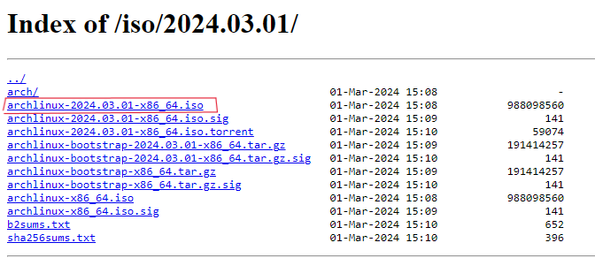
**After downloading do the following steps to prepare your virtual box** 
* select **new** option

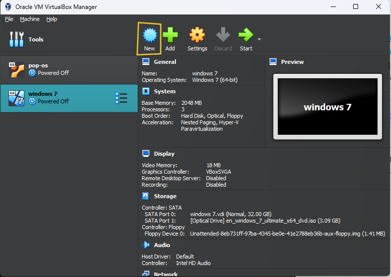

* Write name of Distro like **ArchLinux**

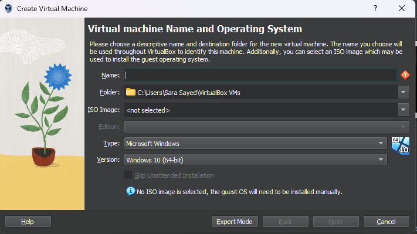

* click here then choose **Other**
  
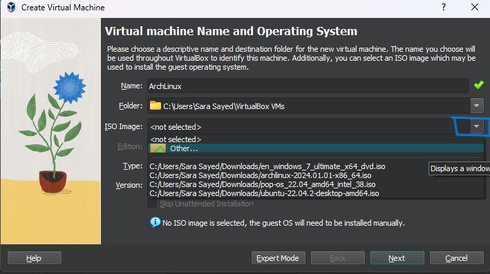

* choose IOS file then click **Open**

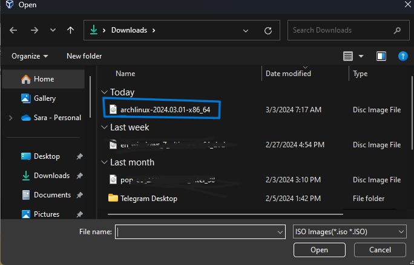

* click **Next**

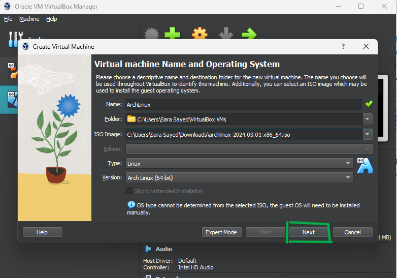

* make **memory 2 MB** and **Processor 2 CPU **then click **Next** 

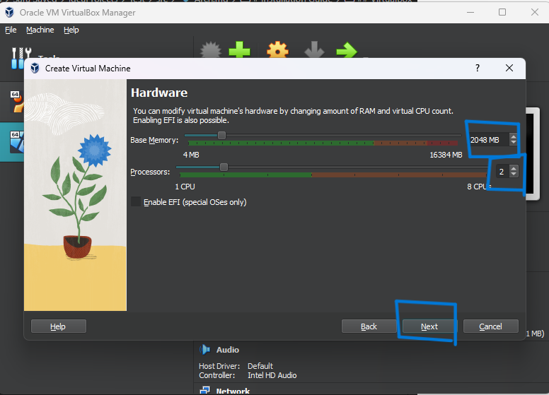

* click **Next**

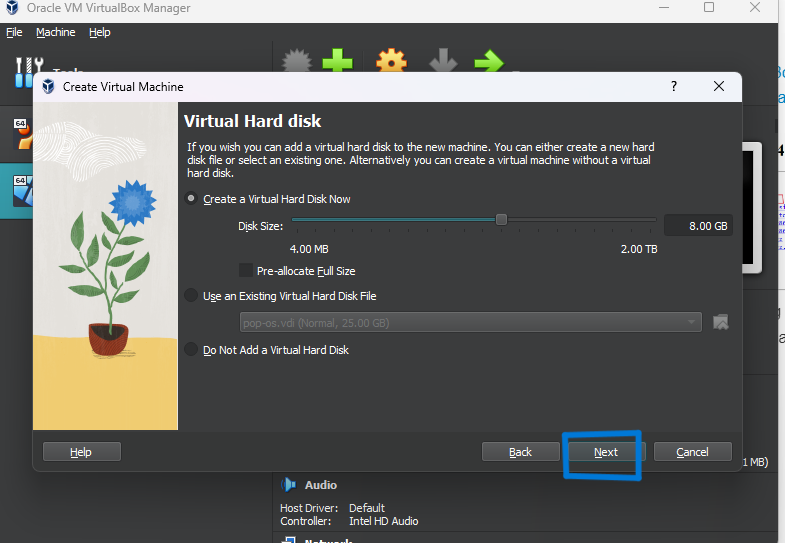

* click **Finish**

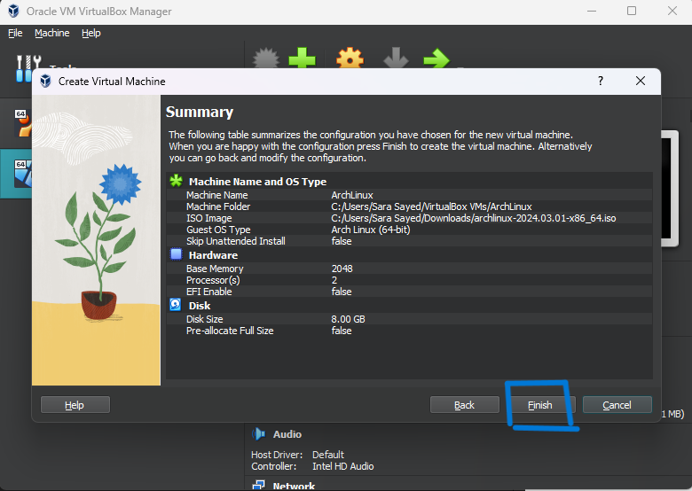

* Click **Start** 

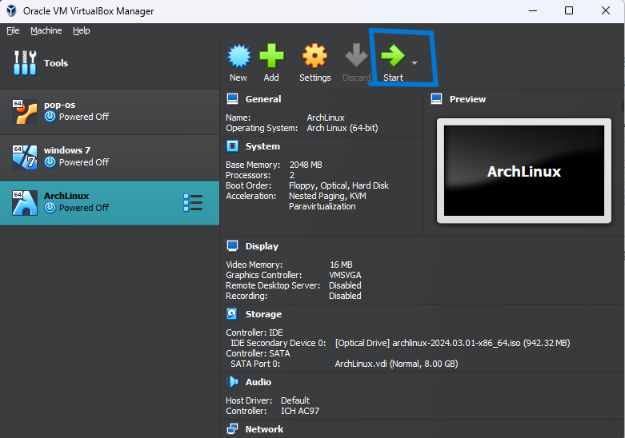

* choose the first option

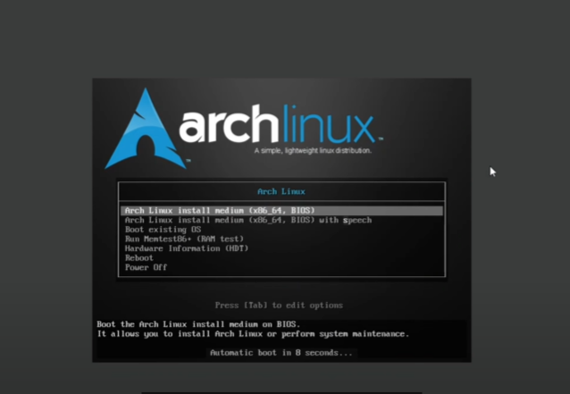

* then this page will apper 

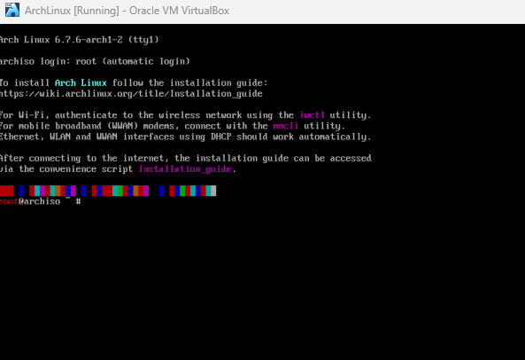

# Setting up Arch Linux
* **Now you should set up Arch Linux using this [repo](https://github.com/SalmaAlassal/dotfiles/blob/main/arch.md)**
## [Recommended Video](https://www.youtube.com/watch?v=Dp0ICJOBNys) 
## Dual Boot
* Download Download [ISO image of Arch Linux](https://archlinux.org/download/)
* You can then burn the ISO image to a USB stick using [Balena Etcher](https://etcher.balena.io/) or [Rufus](https://rufus.ie/en/).
* then follow this [repo](https://github.com/SalmaAlassal/dotfiles/blob/main/arch.md) and this [video](https://www.youtube.com/watch?v=JRdYSGh-g3s&t=131s) 
* Extra Site for help [ArchWiki](https://wiki.archlinux.org/title/Dual_boot_with_Windows)
# More Resources
* [Javapoint](https://www.javatpoint.com/arch-linux-operating-system)
* [ArchWiki](https://wiki.archlinux.org/)
* [ArchFAQ](https://wiki.archlinux.org/title/Frequently_asked_questions)
### You must always remember that Arch Linux is the best distro 

